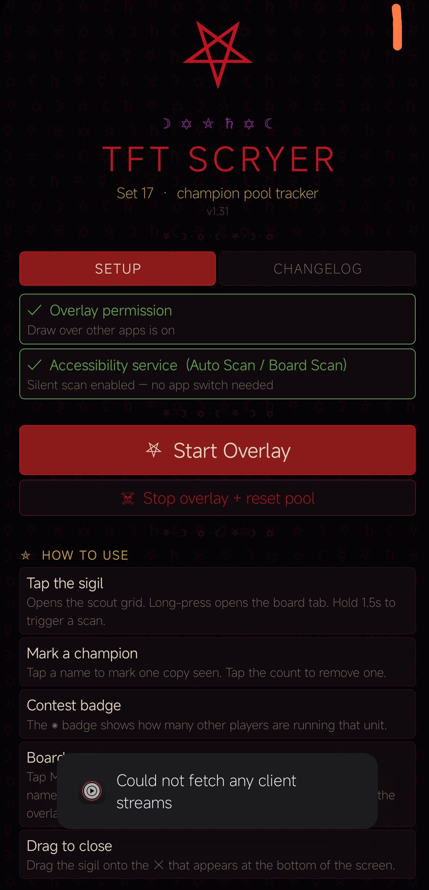
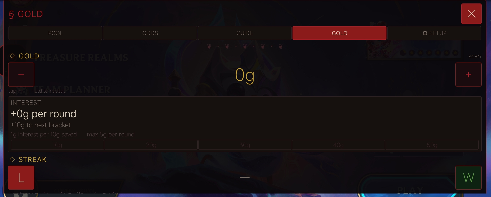

# ⦿ TFT SCRYER

### ✦ Champion pool & reroll-odds overlay for Teamfight Tactics ✦

*A floating overlay for TFT Mobile. Track the champion pool, reroll odds, gold, and your opponents without ever leaving the game.*

 

`❦ · ⋆ · ❦ · ⋆ · ❦ · ⋆ · ❦ · ⋆ · ❦`

**[Screenshots](#-screenshots) · [Features](#-what-you-get) · [Install](#-install) · [Tabs](#-tabs) · [Usage](#-usage) · [Requirements](#-device-requirements) · [FAQ](#-faq) · [Safety](#-is-it-safe) · [Changelog](#-changelog)**

`❦ · ⋆ · ❦ · ⋆ · ❦ · ⋆ · ❦ · ⋆ · ❦`

## ✦ Screenshots

<table>
<tr>
<td align="center" width="50%">
 
<b>Setup</b> · permissions, Start Overlay, and the how-to guide
</td>
<td align="center" width="50%">
 
<b>Gold tab</b> · live interest, bracket ladder, and streak tracking, shown right over the game
</td>
</tr>
</table>

`❦ · ⋆ · ❦ · ⋆ · ❦ · ⋆ · ❦ · ⋆ · ❦`

> **Note:** Android only. Not for PC.

## ✦ What you get

<table>
<tr>
<td width="50%" valign="top">

**◇ Pool tracking**
Tap a champion to mark a copy seen, watch how many copies are left and how contested each unit is.

</td>
<td width="50%" valign="top">

**◇ Reroll odds**
Your real hit chance per roll at your current level, with your carry pinned to the top.

</td>
</tr>
<tr>
<td width="50%" valign="top">

**◇ Auto Scan**
Taps your board for you and reads every unit, star level, gold, and level straight off the screen. No typing.

</td>
<td width="50%" valign="top">

**◇ Opponent scan**
Tap through an enemy board to log their units and star levels, then see who you are contesting.

</td>
</tr>
<tr>
<td width="50%" valign="top">

**◇ Gold planner**
Live interest, the 10 to 50 gold bracket ladder, and win or loss streak income, all over the game.

</td>
<td width="50%" valign="top">

**◇ Augment and item guide**
S to C tier ratings, comp tags, the full component build chart, and trait breakpoints.

</td>
</tr>
</table>

Everything runs on your phone. No accounts, no trackers, no data collection. The only time the app touches the network is the optional self-update check to GitHub (see [Auto-update](#-auto-update)); every tracking, scanning, and gameplay feature works fully offline.

## ✦ Install

1. **[Download the APK](https://github.com/Xanfiend/tft-overlay/releases/latest/download/tft-scryer.apk)**
2. Open the downloaded file. If your browser asks, tap **Open** or **Install anyway**.
3. Android will ask to allow installing from unknown sources. Tap **Settings**, enable it for your browser, then go back and tap **Install**.
4. **Play Protect warning**: Google may show a warning saying the app is not recognised. This is normal for any APK not distributed through the Play Store. Tap **Install anyway** (or **More details → Install anyway** on some devices). The app is safe. The full source code is in this repo.
5. Open TFT Scryer, grant the overlay permission, and tap **Start Overlay**.
6. Launch TFT. The floating sigil appears on screen.

> **Samsung devices**: if Install anyway is greyed out, go to Settings → Biometrics and security → Install unknown apps and enable it for your browser.

## ✦ Auto-update

Since the app is sideloaded (not on the Play Store), you have two ways to stay current:

**Built in (easiest).** TFT Scryer checks GitHub for a newer release when you open it, and there is a **Check for updates** button on the SETUP screen. If a newer version exists it offers to download and install it in one tap. The first time, Android asks you to allow "install unknown apps" for TFT Scryer. Updates install over the top with no uninstall (every release is signed with the same key). This is the only feature that uses the network, and it contacts only GitHub.

**Obtainium (keeps the app from ever touching the network).** If you would rather TFT Scryer never reach out on its own, use [Obtainium](https://github.com/ImranR98/Obtainium): add `https://github.com/Xanfiend/tft-overlay` as a source and Obtainium watches the releases and installs updates for you. (You can ignore the in-app check entirely if you go this route.)

## ✦ Tabs

| Tab | What it does |
|---|---|
| **POOL** | Tap a champion to mark a copy as seen. Tap the number to remove one. The ◉ badge shows how many other players are on that unit. Champions you recently marked show at the top. Tap **Auto Scan Board** to auto-detect all units on your board; tap **Opp Board** to scan an opponent's board with star levels. Both require Accessibility service. |
| **ODDS** | Shows copies left in the pool, how contested each unit is, and your odds of hitting per roll at your current level. Pin your carry to the top. Junk bench-thinning adjusts odds for units you are holding to block others. |
| **GUIDE** | Two sub-tabs: AUGMENTS (S/A/B/C tier list with comp tags, priorities, exclusions, and armory rules) and ITEMS (tap two components to see the combined item, full trait breakpoints below). |
| **GOLD** | Track your gold with live interest calculation, the 10/20/30/40/50g bracket ladder, win/loss streak tracking with bonus scale, and expected income next round. Hold + or - to change gold quickly. |
| **SETUP** | Accessibility service status with setup instructions. Scan Now fills gold, level, and augments. Transparency, haptic, start-tab choice, button position reset, calibration controls, and debug log. |

## ✦ Usage

- **Tap the sigil** to open the grid. **Long-press** to open the board. **Hold 1.5s** to trigger a scan instantly.
- **Auto Scan Board**: tap Auto Scan Board in the grid tab. The app taps all board hexes (front row first) and bench slots, reads the popup after each, and marks all found champions. Stops after 5 consecutive empty board hexes, then scans the bench and stops after 3 empty bench slots. If templates are saved from previous scans, known units are identified instantly from a single screenshot before any tapping begins. Typical time is 5-15 seconds. Tap the sigil to stop early.
- **My Board scan**: tap My Board in the grid tab, then tap each unit on your board manually. The app reads the name from the stat popup and marks it in your pool. 25 second window.
- **Opp Board scan**: navigate to an opponent's board in TFT, tap Opp Board, then tap each of their units. Reads name and star level (shown as Jinx ★★) and increments their contest badge. 30 second window. All three scans require the Accessibility service (one-time setup in Settings).
- **Drag the sigil** to move it. Drag it onto **✕** to close the overlay.
- **Reset** between games to clear pool, gold, and contest data.

## ✦ Device requirements

| | |
|---|---|
| **OS** | Android 7.0 or later (API 24+) |
| **Permissions** | Draw over other apps (required). Screen capture via Scan Now (optional). |
| **Internet** | Only for the optional in-app update check (GitHub). All scanning, tracking, and gameplay work fully offline. |
| **Storage** | About 10 MB installed. |
| **Scan Now** | Works on Android 7.0+. On Android 14+ some devices (Xiaomi MIUI, some Samsung OneUI builds) may have issues with screen capture. The debug log in Settings will show the exact error if it fails. |
| **Board Scan / Silent Scan** | Requires the Accessibility service enabled (Android 12+ only). Go to Settings tab in the overlay, tap App settings, allow restricted settings, then go to Accessibility and turn on TFT Scryer. |
| **Tested on** | Android 10, 12, 13, 14. Should work on 7.0 and above. |

## ✦ FAQ

<b>Does it work on iPhone?</b>
 

No. Android only.

<b>Does it work on PC?</b>
 

No. It is a mobile overlay for TFT Mobile on Android.

<b>The overlay does not appear over TFT.</b>
 

Open TFT Scryer, tap Start Overlay, then switch to TFT. If it still does not show, go to Android Settings and make sure TFT Scryer has the "Display over other apps" permission.

<b>The app crashes when I tap Scan Now.</b>
 

This is a known issue on some devices (especially Xiaomi / MIUI). Update to the latest version from the releases page. If it still crashes, open Settings in the overlay after the next scan attempt and check the Debug Log card for the exact error.

<b>Scan Now runs but detects nothing / wrong values.</b>
 

The scan reads text from your screen using OCR. Make sure the TFT game screen is visible and not covered when you tap Scan. Bright HUD elements and high contrast help. Detection is best on a clean shop or augment screen.

<b>Play Protect says the app is not recognised / blocks the install.</b>
 

Tap **Install anyway** or **More details → Install anyway**. Play Protect warns about any APK not distributed through the Play Store, regardless of whether it is safe. This app collects nothing and contacts only GitHub, and only to check for and download its own updates. The full source code is in this repo. If the button is greyed out, go to Settings → Biometrics and security → Install unknown apps and enable it for your browser, then try again.

<b>A virus scanner flagged the APK.</b>
 

Same reason as above. It is a common false positive for APKs not signed by a Play Store publisher. Full source is here, check it yourself or see the VirusTotal link below.

<b>The champion pool data is out of date.</b>
 

Pool data updates with each new version. Check the releases page for the latest APK. If a new patch just dropped and the app has not updated yet, open an issue.

<b>I want to report a bug or suggest something.</b>
 

Open an issue on this repo or message [@xanfiend](https://instagram.com/xanfiend).

## ✦ Is it safe?

Yes. The full source code is in this repo, so you can read exactly what it does or build it yourself.

[VirusTotal scan of the APK](https://www.virustotal.com/gui/file/effaa42fd316d6aa3a2948ee1b0370b176b2a6196d6da846e717dde3ae5f55f0/summary)

The app only needs the "draw over other apps" permission to show the overlay on top of TFT. The optional Scan Now feature asks for screen capture permission to read your gold, level, and augments. All of that stays on your phone. The only network use is the optional self-update check, which contacts GitHub and nothing else — no analytics, no accounts, no data collection. If a virus scanner flags it, that is a common false alarm for self-built APKs and not a real threat.

## ✦ Changelog

### v1.70 - 2026-06-16
- **Fixed the in-app updater always reporting "you're on the latest version."** The rolling GitHub release accumulates every past APK as an asset, and the updater was returning the *first* matching asset (an old `v1.10` build) instead of the newest — so the version comparison always failed. It now takes the **highest** version across all assets and the release title.
- **Note:** the broken check is baked into versions ≤ 1.69, so the in-app updater won't offer this one. Install this APK manually once from the [releases page](https://github.com/Xanfiend/tft-overlay/releases/latest) (or via Obtainium); auto-update works normally from then on.

### v1.69 - 2026-06-15
- **NEW always-on gold & XP reader** (SETUP tab, off by default): once enabled it quietly re-reads your real gold and level/XP off the screen every couple of seconds and keeps the in-game HUD numbers accurate without any taps. It pauses itself during a hunt or scan.
- **THE HUNT (auto-buy) no longer has a 2-minute timer** — it now runs until you stop it.
- **NEW on-screen STOP button**: starting the hunt, Board Scan, Opp Scan, or Auto Scan now shows a big draggable STOP button, so you can end it with one tap instead of finding the floating sigil.
- **Fixed a serious bug** where the game could stop responding to touch/drag after using auto-buy or a scan, persisting even after closing the overlay. Every injected tap now has a hard timeout and can never overlap another, and every full-screen calibration overlay is forcibly removed whenever a hunt or scan starts or stops.

### v1.68 - 2026-06-15
- **Fixed THE HUNT (auto-buy) never buying in landscape**: the shop watcher was scanning a fixed band near the *bottom* of the screen, but TFT Mobile draws the shop along the **top** in landscape — so it was reading the board, never the shop, and bought nothing. It now scans the shop's real position (top in landscape, bottom in portrait) and buys marked champions on sight again.
- The hunt no longer tries to read your gold from the shop strip (the gold counter isn't there) — it buys marked champions whenever they appear, and TFT simply ignores any you can't afford.

### v1.67 - 2026-06-15
- **NEW in-app auto-update**: the app now checks GitHub for a newer release on launch (and via a **Check for updates** button in SETUP), and installs it in one tap. Updates apply over the top — no uninstall — since every release shares a signing key. This adds the `INTERNET` permission; it is the only feature that uses the network and it contacts only GitHub. All scanning, tracking, and gameplay remain fully offline, and there are still no trackers or data collection.
- Prefer the app never touch the network? Use **[Obtainium](https://github.com/ImranR98/Obtainium)** instead — see [Auto-update](#-auto-update).

### v1.66 - 2026-06-15
- **Fixed "This service is malfunctioning" / the overlay dying on its own** (most common on Xiaomi/HyperOS and other aggressive-battery ROMs). The overlay now runs as a proper **foreground service** with a quiet ongoing notification, keeping its process resident. The silent-scan accessibility service shares that process, so it's no longer killed and flagged as malfunctioning. A small "TFT Scryer is watching" notification appears while the overlay is up — that's what keeps it alive.
- If a ROM still kills it, also enable **Autostart** and set battery usage to **No restrictions** for TFT Scryer in your phone's settings.

### v1.65 - 2026-06-15
- **Fixed the accessibility "stuck" status lingering**: after toggling the service back ON, the SETUP panel kept showing "Stuck — switch shows ON but the service is not running" until you manually reopened it. It now refreshes the instant Android binds the service, flipping to "Enabled" on its own.
- The **Accessibility settings** button now deep-links straight to TFT Scryer's own service page (Android 12+) instead of the full list, so the OFF-then-ON fix for a stuck toggle is one tap away.

### v1.64 - 2026-06-12
- **NEW SCRY THE PLANNER** (POOL tab): reads your whole board in one pass with **zero unit taps**. The scan opens the Team Planner, presses Snapshot (the one place the game shows every fielded unit as flat 2D art instead of a 3D sprite), names each tile against champion icons bundled in the app, then closes the planner without confirming — the game is untouched. ~5 seconds for any board, even units the app has never seen.
- One-time setup: **CALIBRATE PLANNER** in the SETUP tab walks you through five taps (planner button, Snapshot button, first/last snapshot slot, close control); your taps are replayed into the game so the planner really opens while you point things out.
- Star levels come from the same health-bar read Auto Scan uses; tiles the icons can't name with confidence are reported as unknown — SCRY MY BOARD reads those by popup as before.
- New `fetch-icons` workflow pulls the current set's champion icons from CommunityDragon into `assets/seticons/` (re-run it on each set update). Champion art © Riot Games, used under Riot's [Legal Jibber Jabber](https://www.riotgames.com/en/legal) policy — this is a free fan project, not endorsed by Riot.

### v1.63 - 2026-06-12
- **In-game HUD fixed + glowing**: the gold pill now defaults near TFT's actual gold counter (bottom-right corner) instead of the middle of the board; the XP-to-level pill moved to match. Both pills now have a slow pulsing glowing outline so they're easier to spot over the game.
- **NEW Fast Scan** (SETUP tab): an optional one-time screen-recording permission that lets Board Scan and Opp Scan poll the live capture instantly, skipping the 1-second screenshot wait. Off by default, toggle ON/OFF anytime. (THE HUNT's auto-buy already had its own fast capture — see v1.61/v1.62.)

### v1.62 - 2026-06-12
- **THE HUNT is ~3x faster**: arming the hunt now requests screen-capture permission and watches the shop via a continuous MediaProjection stream (~3 checks/second) instead of the rate-limited accessibility screenshots (1/second). A marked champ is bought within ~0.3s of appearing. Android shows its recording indicator while hunting; everything stays on-device. Denying the dialog falls back to the 1/sec watcher automatically.

### v1.61 - 2026-06-11
- **THE HUNT (auto-buy)**: hold a champion's name in the GRIMOIRE to mark it as prey (✦, up to 5 marks), then press BEGIN THE HUNT on the POOL tab. The overlay watches your shop ~once a second for 2 minutes and instantly buys any marked champion that appears — reroll freely, the hunt does the buying. Gold-aware (skips buys you can't afford), every purchase is auto-recorded in the pool, tap the sigil to stop. Android's 1-screenshot/second limit means a buy lands within ~1s of the shop showing the champ.
- **In-game HUD reworked**: now two tiny separate draggable numbers instead of one box — `+Ng` (projected income) to park above the game's gold counter, and `Ng→L` (gold to next level) to park above the XP button. Each remembers its own position.

### v1.60 - 2026-06-11
- **In-game HUD**: a small draggable overlay sits on top of TFT itself (separate from the main panel), showing your gold + projected income for next round and exactly how much gold you still need to reach your next level. Updates live as you scry or make manual corrections. Toggle on/off and drag to position from the SETUP tab's IN-GAME HUD section.

### v1.59 - 2026-06-11
- **Rolldown forecast**: every tracked champ on the ODDS tab shows P(≥1/≥2/≥3 copies) for rolling your current gold, Monte-Carlo simulated over the real shop process, plus average gold to the first copy.
- **One-press self scry**: now also reads XP progress and the stage-round, alongside level, gold and every unit.
- **LEVELING & STAGE FORECAST cards** on the GOLD tab: exact gold to next level from scanned XP, loss-damage estimate per stage, Realm of Gods / PvE reminders.
- **Per-opponent boards**: each enemy scry files automatically as OPP 1–7 with remembered champs and stars.
- **Learned synergies**: the overlay learns champ→traits from scry popups and shows active trait counts with next breakpoints.
- **Realm of Gods tracker** (GUIDE tab), **scanned augments remembered** (AUGMENTS tab), **new-game reset banner**, **bench scan auto-fills junk counters**, **Frying Pan** in the item builder.
- Econ corrections: asymmetric win/loss streak gold + win gold in expected income; Set 17 bag sizes (29/22/18/10/9) and corrected level 8–9 shop odds.

### v1.58 - 2026-06-11
- The overlay is now automatic-first, in full occult dress. The POOL tab opens with **THE RITE**: ⛧ SCRY MY BOARD (level, gold and every unit in one press) and SCRY THE ENEMY (scout a foe's board). The Opp Manual tap-it-yourself mode was removed — the automatic enemy scan replaces it.
- The GOLD tab now leads with a SCRY GOLD & LEVEL button; the ± steppers remain only as manual corrections.
- Manual champion chips remain under a GRIMOIRE · CORRECTIONS section for amending the rare scan miss; the level row stays as a manual override. Streak stays manual (the game shows no streak number to read).

### v1.57 - 2026-06-11
- Fixed a bug where Auto Scan's duplicate-copy detection (v1.56) could record a unit just after the results screen was already drawn, so it silently never showed up in the pool count. The results screen now refreshes itself if a late duplicate find arrives after the scan finishes.

### v1.56 - 2026-06-11
- Auto Scan now detects duplicate copies of a champion in the same screenshot, without tapping each one. After a champion is identified from a tap, the app checks the other untapped board units in that screenshot for a visual match (including their star level) and records any matches immediately.
- This speeds up scanning boards with 2 star or 3 star units, or several copies of the same low cost champion, since fewer taps are needed.

### v1.55 - 2026-06-11
- Real fix for the tab-switch flicker. The whole panel (including its background and border) was being faded out and back in on every tab switch, so for one frame the panel had no background at all, which looked like a flicker.
- Now only the body content below the tab row fades when you switch tabs. The panel frame, header and tab row stay put and never disappear.

### v1.52 - 2026-06-10
- Animated app background. The launch screen now has slow-drifting glowing embers floating up behind the content, with a gentle twinkle, in the app's red, gold and violet colors.
- It only runs while the launch screen is on screen and stops completely when the app goes to the background, so it costs no battery otherwise. The in-game overlay panel is untouched.

### v1.51 - 2026-06-10
- Real fix for the animations. Switching tabs rebuilds the whole panel, and that rebuild took longer than the animation, so the fade finished invisibly before the first new frame reached the screen. Animations now start on the new content's first drawn frame, so the panel entrance and tab cross fades actually play. Tab switches also slide up slightly.
- Star levels for every scanned unit. Units recognized by sprite (no tap needed) now get their star level from the color of the star icons above their health bar: bronze is 1 star, silver is 2, gold is 3. Color is used instead of unit size on purpose, since size also changes with naturally-big champions and combat effects.
- If the popup text misses the stars on a tapped unit, the bar-icon color fills in as a backup. Star counts show next to each name in the AUTO SCAN and OPP SCAN results.

### v1.50 - 2026-06-10
- ADJUST GRID upgrade: row spacing and bench length are now adjustable too.
- The two middle board rows each get their own gold ring you can drag up and down, so the rows can be spaced exactly on your units instead of sitting at fixed positions.
- The bench now has a ring on each end, so you can stretch it to match the real bench slots instead of it being tied to the board width.
- Auto Scan, Auto Opp Scan and SHOW DOTS all use the new spacing and bench length.

### v1.49 - 2026-06-10
- New way to calibrate: ADJUST GRID. The old calibration asked you to tap four corner units blind, and a slightly off tap meant scans missed units.
- The new ADJUST GRID button in the SETUP tab shows every scan dot live on top of the game. Drag the gold rings on the four board corners and the bench until the dots sit exactly on your units, then tap SAVE. What you see is exactly where the scan will tap.
- It starts from your current calibration, so you can nudge an almost-right grid instead of redoing it from scratch. The old TAP TO CALIBRATE and the fine tune rows are still there too.

### v1.48 - 2026-06-10
- Fix for overlay animations not playing. Switching tabs or opening the panel just flickered instead of fading smoothly.
- Overlay windows made by a background service are drawn in software mode by default on Android, and in that mode animations skip their in-between frames. The overlay windows now use hardware accelerated drawing, the same as normal app screens.
- Tab switches now cross fade properly, the panel scales and fades in when opened, and the floating button animations play smoothly.

### v1.47 - 2026-06-10
- Fix for Auto Scan only finding a few units on the board after calibration. A tap that landed slightly off a unit was counted as empty right away, so a calibration that was a little off in either direction could miss most of the board.
- Every board tap that comes back empty now gets up to two more tries at slightly different positions, one a bit lower and one a bit higher than the original spot, before it is given up on. This applies to your own board scan and Auto Opp Scan.
- The scan can take a little longer when it needs these extra tries, but it should now pick up far more of the units on the board.

### v1.46 - 2026-06-10
- Fix for Accessibility acting up after updates. Android sometimes leaves the Accessibility switch showing ON after an update without actually restarting the service, so everything looks enabled but no scan works.
- The app now detects that stuck state. The setup screen and the overlay SETUP tab show a clear Stuck status with the fix: open Accessibility settings and toggle TFT Scryer OFF, then ON again. The launch screen card has a one-tap button to the right settings page.
- Scan buttons now say the service is stuck and how to fix it, instead of the generic enable message.

### v1.45 - 2026-06-10
- Fix: probe dots were bunching up at the front of the board after calibration. If the front row was tapped before the back row during TAP TO CALIBRATE, the stored positions ended up swapped and the row spacing ran backwards.
- Calibration now corrects a swapped tap order automatically when saving, and also repairs an already saved swapped calibration on the fly, so no recalibration is needed.
- The same correction applies to the opponent board grid used by Auto Opp Scan.

### v1.44 - 2026-06-10
- Game data updated for TFT patch 17.5 (live June 9). The augment guide now matches the big 17.5 augment pass: econ augments were toned down and combat augments were buffed.
- Comp priorities updated. Vex Fast 9 is back on top after her rebuff, Stargazer Xayah dropped after the Serpent poison fix, Space Groove Ornn was nerfed at every breakpoint, and 5-Meeple Rammus lost its built-in bonuses while 7-Meeple boards opened up.
- Champion roster and pool sizes did not change in 17.5, so your tracking carries over as is.

### v1.43 - 2026-06-10
- Visual polish pass across the app and overlay. The floating sigil now bounces in when the overlay starts and gives a quick press animation on every tap.
- The overlay panel fades and scales in when it opens instead of snapping into view, and switching tabs now cross-fades the new content in. Tab buttons and the close button give the same press feedback.
- On the launch screen, the hero sigil has a slow ambient glow pulse, tab content fades in smoothly when switching between Setup and Changelog, and every button gives a soft press animation.

### v1.42 - 2026-06-10
- Auto Scan rebuilt for reliability and speed. Health bar detection now uses colour ratios instead of fixed colour values, so it works whether your screen renders bright or dim. It runs a standard pass first and a stricter pass only if the first picks up too much. Candidate bars must also pass shape checks (a thin floating strip with clear space above and below), which rules out green grass and trees.
- New: Instant Visual ID. Every unit read by popup teaches the app what that champion looks like standing on your board. On later scans, learned units are recognized straight from the first screenshot with no tapping, so the scan gets faster every game. Only sure matches skip the tap. The results list shows which units were read by popup and which were recognized visually. Toggle in SETUP.
- If a smart position taps empty ground, the scan retries slightly lower once before counting a miss. If smart positions turn out wrong for your screen, the scan switches to the calibrated grid mid run instead of wasting the remaining taps.
- SHOW DOTS banner now says which colour pass found your units. The scan log shows total scan time and how each unit was identified.

### v1.41 - 2026-06-09
- Tap anywhere outside the panel to close it. No need to reach for the X or DONE button.
- The floating button now slides to the nearest screen edge after you drag it, so it stays out of the way of the board, and it comes back on screen if dropped half off the edge.
- A finished Auto Scan gives a double vibration so you can feel it complete without watching the screen.
- Faster panel rendering: champion cost lookups are now cached instead of scanning the full name list every time, which makes tab switching snappier on slower phones. Champion name matching during scans also got faster.

### v1.40 - 2026-06-09
- Fix: Smart Scan was detecting a false unit on an empty board and missing real units when champions were present. The health bar colour filter was too loose, picking up green arena elements like grass and bamboo instead of just health bars.
- The filter now requires a much brighter, more saturated green with very low red, matching actual TFT unit health bars and rejecting background colour. The enemy red bar filter got the same pass.
- The debug log now shows the exact RGB colour values of every bar detected, so if detection drifts you can share the log and the numbers can be tuned precisely.

### v1.39 - 2026-06-09
- SHOW DOTS now shows a status banner: SMART SCAN with a unit count means the markers are real units found by their health bars (calibration irrelevant), GRID FALLBACK means detection found nothing and it used the calibrated grid (the one that can look crowded toward the front).
- Diagnostic aid: a screenshot of SHOW DOTS over your board now shows whether health bar detection is working on your device.

### v1.38 - 2026-06-09
- Smart Scan no longer needs calibration. It searches a fixed region of the screen for unit health bars (lower-centre for your board, upper half for the enemy in combat) instead of using calibrated probe positions, so it finds and taps the actual units even if calibration is untouched or a little off.
- Calibration is now only a fallback grid for the rare case health bar detection finds nothing. SHOW DOTS, with Smart Scan on, takes a real screenshot and draws a marker on every detected unit so you can see exactly what the scan sees.

### v1.37 - 2026-06-09
- New: Smart Scan. Auto Scan now finds your units by looking for their health bars in the screenshot and taps the exact spot each unit is standing, instead of tapping calibrated grid dots. It lands on the units even if calibration is a little off, and skips empty hexes. Auto Opp Scan does the same using the enemy red health bars.
- Calibration still sets the rough board area, but exact dot placement no longer matters. If health bar detection looks wrong the scan falls back to the calibrated grid, and you can turn Smart Scan off in the SETUP tab.

### v1.36 - 2026-06-09
- New: Auto Opp Scan. The Grid tab now has an Auto Opp Scan button next to Auto Scan. Tap it during combat and the app automatically taps through the opponent board zone (the mirrored side of the screen, opposite your own board), reads each champion name from the unit popup, and marks them as contested in the badge column.
- No manual tapping needed. The scan stops after finishing all probes or after 35 seconds. The old Opp Manual button is still there if you prefer to tap each unit yourself.

### v1.35 - 2026-06-09
- Fix: bench probe row was landing a little too far to the right. The default now shifts the bench 4% left to align with where the TFT Mobile bench slots actually sit. You can fine tune it using the new Bench L/R shift slider in SETUP under calibration (negative = left, positive = right).
- Auto Scan now also skips empty bench slots by analysing the board screenshot it already takes at the start, the same way it skips empty board hexes. No more tapping through the empty slots at the end of your bench.

### v1.34 - 2026-06-09
- Speed: Auto Scan no longer taps empty hexes. Since Android caps screenshots at one per second, the slow part of the scan was visiting all the empty board space.
- The scan now reads the one board screenshot it already takes at the start, works out which hexes actually have a unit on them (a champion sprite has a health bar and lots of detail, an empty hex is flat ground), and only taps those. On a normal board that is about the number of units you have instead of all twenty eight hexes, so it finishes much faster.
- It is cautious on purpose: if a hex is even a little ambiguous it still taps it, and if the detection looks off it falls back to tapping everything like before, so it should not miss units. The in app debug log shows what it decided. Your bench is always fully scanned.

### v1.33 - 2026-06-09
- Fix: Auto Scan was missing most units after the v1.31 speed update. Android only allows an accessibility service to take one screenshot per second, and the speed update made the scan tap and shoot faster than that, so the system was quietly rejecting most of the screenshots and those units never got read.
- The scan now spaces its screenshots out to stay under the one per second limit, and if a screenshot still gets rejected it waits and retries the same hex instead of skipping it. Auto Scan reads every unit again.
- The tradeoff is that the one per second screenshot limit sets a hard floor of about a second per unit, so a full board takes a little longer, but it is accurate now. A smarter version that only taps hexes with a unit on them is coming next.

### v1.32 - 2026-06-08
- Auto Scan now reads your gold and level too, not just champions. Right before it starts tapping hexes, it takes one extra screenshot of the board and reads the gold count and level number out of the corners, the same way the regular Scan Now button does.
- Those numbers are saved straight into your gold tracker and level, and shown at the top of the auto scan results once the scan finishes, so you do not have to type them in by hand.

### v1.31 - 2026-06-07
- Speed: Auto Scan is noticeably faster. The board scan taps each hex, waits for the unit popup, screenshots, and reads the name dozens of times in a row, so every small delay adds up across the whole board.
- Trimmed the per-tap timing: shorter tap, shorter wait for the popup to show up, and a shorter gap before the next tap.
- The screenshot is now shrunk down before the text reader looks at it, so there are far fewer pixels to process per unit. The champion name stays just as readable, so detection accuracy does not change.
- Removed repeated text cleanup that was running on every single name comparison, and made the visual board matching read pixels in one batch instead of one at a time.
- If you ever notice a unit getting missed, it likely means a popup did not finish appearing in time. The timing values are now in one place in the code and easy to nudge back up.

<b>Older versions (v1.0 - v1.30)</b>

### v1.30 - 2026-06-07
- Fix: the probe dots were landing in the right place all along, the dots themselves were just drawn too big to tell. The TFT board is shown at an angle, so the back rows sit closer together on screen than the front rows. The dots had a fixed size that did not shrink for the back rows, so neighbouring dots overlapped into what looked like a tangled mesh, even though their centers were correctly placed in a clean grid.
- Dots now shrink to fit the actual gap between neighbouring points, so the back rows look as clean as the front rows, and nothing overlaps.
- This was the real cause of the crisscross look reported after both v1.28 and v1.29. The placement math in those versions was already fine, which is why changing it did not fix the look of the dots.

### v1.29 - 2026-06-07
- Fix: the v1.28 sideways stagger correction made probe dots worse on TFT Mobile, not better. It worked out a sideways shift from real measured PC board coordinates and applied it to alternating rows, but on phones that shift came out too large and turned the dots into a dense crisscross mesh instead of clean rows lined up on the hexes.
- Removed that correction and went back to plain smooth interpolation between the four corners measured during calibration. Users confirmed this lines up well.
- The 5-step calibration guide from v1.28 stays, since measuring the front-left corner directly is still more accurate than guessing it from symmetry. Only the math that places the dots between the four corners changed.
- If your dots still look slightly off, re-run TAP TO CALIBRATE in the SETUP tab and try to tap as close to the exact center of each unit as you can. Small taps on the wrong spot get stretched across the whole grid.

### v1.28 - 2026-06-07
- Fix: probe dots were still landing slightly off to the side on every other row. We dug into real measured TFT board coordinates and found the board uses a staggered hex grid (the hexes are pointy-top, and every other row is shifted sideways by about half a hex width), stacked on top of the front-to-back perspective that v1.27 already handled.
- The old calibration also worked out the front-left corner using left-right symmetry, which does not hold once you account for the stagger, so that corner could be off.
- Calibration is now a 5-step guide that taps all four board corners directly: back row left, back row right, front row left, front row right, then bench. The probe grid works out the sideways stagger from those four points and applies it to each row, on top of the existing perspective spacing.
- After updating, re-run TAP TO CALIBRATE in the SETUP tab so the new 5-step guide can take real measurements of your screen.

### v1.27 - 2026-06-06
- Fix: probe dots still did not land on the hexes. The grid was generating 5 rows when a standard board has 4, so an extra row floated off the board and every row drifted out of place.
- Fix: rows were spaced evenly down the screen, but the TFT board is drawn in perspective (back rows compressed, front rows spread apart), so the middle dots fell into the gaps between hexes. The grid now uses 4 rows with perspective spacing (gaps grow toward the front) and interpolates the trapezoid left and right edges with the same curve.
- Calibration now stores the front row directly. After updating, re-run TAP TO CALIBRATE in the SETUP tab for the tightest fit.

### v1.26 - 2026-06-06
- UI redesign: 5 tabs instead of 6. GRID renamed to POOL. BOARD renamed to ODDS. AUGS and ITEMS merged into a single GUIDE tab with sub-tabs (switch between AUGMENTS and ITEMS at the top of the tab).
- SETUP tab (was SETTINGS) now shows Accessibility permission status as the first thing, with a clear card showing enabled or disabled and step-by-step instructions if it needs to be turned on.
- Scan buttons in POOL tab now sit side by side instead of stacked.
- ODDS tab shows a step-by-step guide when nothing is tracked yet instead of a blank message.
- GOLD tab shows the interest formula (1g per 10g saved, max 5g) and the streak bonus scale (2+ streak = +1g, 4+ = +2g, 6+ = +3g) inline under the relevant sections.
- Calibration guide text corrected from "3-step" to "4-step" to match the actual calibration flow.

### v1.25 - 2026-06-06
- Fix: probe dots were not landing on hexes across all rows because the TFT board is trapezoidal in screen space (the front row is wider than the back row). The previous grid assumed all rows had the same left and right edges, which was wrong.
- Calibration now collects 4 points: back-left unit (top row), back-right unit (top row), front-right unit (bottom row), then bench. The probe grid interpolates left and right edges per row between the calibrated corners so dots land on hexes from top to bottom. The front-left corner is inferred from board symmetry, so you only tap 3 board points.
- After calibrating, the settings screen shows the computed corner percentages so you can verify the values are reasonable.

### v1.24 - 2026-06-06
- Fix: tap-to-calibrate was offset to the right. The capture overlay used raw touch coordinates against full-screen metrics, but in landscape the status bar / notch inset shifted everything sideways. The capture overlay now shares the exact same full-screen window and coordinate space as the probe dots, so a tap maps 1:1 to where the dot is drawn.
- Debug aid: during tap calibration each tap draws a green crosshair where it registered, with a live readout showing the tap pixel position, the percent values, and the view size. This makes any coordinate offset immediately visible on screen.

### v1.23 - 2026-06-06
- Setup screen now shows both permission statuses with one-tap fix buttons. After an update, open the app and both the overlay permission and Accessibility service status are immediately visible with direct buttons to restore them. Android always disables the Accessibility service on update (this is an Android security policy, not a bug) - the card explains this and shows a 30-second restore path.

### v1.22 - 2026-06-06
- Fix: tap-to-calibrate probe dots were landing between board rows instead of on them. Column positions were calculated using hex centers instead of board edges (shifted inward). Row step used /4 instead of /3, placing rows 1 and 2 between actual hex rows. Both fixed - probe dots now land on hex centers after tap calibration.

### v1.21 - 2026-06-06
- Tap to calibrate: tap TAP TO CALIBRATE in Settings, then tap 3 actual units in TFT (top-left board unit, bottom-right board unit, any bench unit) to set all 5 calibration values in one go. No more slider-guessing from wrong defaults.
- After the 3 taps the probe dots appear automatically to confirm the positions are correct.
- Skip button on step 3 if you want to calibrate only the board and leave the bench at its current value.
- Screen rotation during calibration cancels safely.
- Sliders still available for fine-tuning after tap calibration.

### v1.20 - 2026-06-06
- Fix: probe dots and Auto Scan were completely outside the board in portrait mode. The board starts at ~22% screen height in portrait, not 39%.
- Scan coordinates are now stored separately for portrait and landscape orientation.
- Calibrate Scan in Settings now labels which orientation is being adjusted (PORTRAIT or LANDSCAPE) and RESET only resets the current orientation.
- Portrait defaults: board top 22%, bottom 65%, left 12%, right 88%, bench 75%.

### v1.19 - 2026-06-05
- Fix: Auto Scan was missing units in Tocker's Trials and on boards where units sit lower on screen (player board at y 50-72%).
- Scan now uses 5 probe rows instead of 4, extending bottom coverage from 65% to 72% of screen height.
- Early-stop threshold for consecutive board misses raised from 5 to 8. One fully empty probe row (7 columns) no longer aborts the scan before reaching the units below it.
- Default Board bottom calibration updated from 65% to 72%.

### v1.18 - 2026-06-05
- Fix: default probe grid was too narrow. Board left edge moved from 28% to 8% because units in the left 3 columns were never tapped. Board right extended from 70% to 88%. Front row bottom corrected from 60% to 65%. Bench moved from 72% to 80%.
- Use Settings -> Calibrate Scan -> SHOW DOTS to fine-tune for your specific device.

### v1.17 - 2026-06-05
- Calibrate Scan (Settings tab): nudge board top, bottom, left edge, right edge, and bench row by 1% increments until the probe dots land on your board hexes.
- SHOW DOTS button closes the panel and draws numbered circles over TFT, red for board probes, blue for bench probes, in scan order. Fades after 5 seconds.
- Calibration values persist across restarts. RESET returns to defaults.
- Tabs reordered to Grid, Econ, Board, Augs, Items, Settings and labelled with words instead of symbols. Tap targets are taller.
- My Board manual scan button removed from Grid tab (Auto Scan covers it). Opp Board promoted to a full-width button.

### v1.16 - 2026-06-05
- Fix: Auto Scan was detecting Leona (and other 5-letter champion names) when they were not on the board. The 80% partial-match rule let a 4-letter OCR fragment like "leon" count as a match for "Leona". Short names (under 6 letters) now require a full match.
- Debug: when the scan sees a popup but finds no champion name in it, the raw OCR text is now written to the scan log. This makes it possible to diagnose what the text reader actually saw for missed units.

### v1.15 - 2026-06-05
- Fix: Auto Scan was tapping outside the board area, hitting the Buy XP button, Refresh button, and the trait panel. Board and bench probe coordinates now use confirmed TFT Mobile hex positions.
- Board x range narrowed to 28-70% of screen width to clear the trait panel on the left and the health bar on the right.
- Bench probe moved from 80% to 72% screen height, placing it on the actual bench row instead of the shop button zone.
- All four board rows now use exact y positions. The previous estimate placed back-row probes in empty air above the board.

### v1.14 - 2026-06-05
- Fix: Auto Scan was tapping into the augment panel at the top of the screen. The board probe zone now starts lower, keeping all four board rows clear of the HUD and augment area.
- Fix: when the board had no units, all 28 board probes ran before the bench was reached because the early-stop only triggered after the first hit. Any 5 consecutive board misses now skip directly to the bench instead of stopping the whole scan.

### v1.13 - 2026-06-05
- Scan speed and accuracy pass. The text reader is now built once and reused instead of being rebuilt on every hex. Each screenshot is cropped to the unit popup band before reading, which means fewer pixels to process and no shop, bench, or trait text in view to misread. Per-hex logging was trimmed so the scan does not spend time writing logs. The tap gesture and the gap between taps were shortened. The detection zone is unchanged, so accuracy holds while a full board scan finishes noticeably faster.

### v1.12 - 2026-06-05
- Fix: Auto Scan was stopping early after tapping on an item. The scan now distinguishes between an empty hex (no popup appeared) and a non-champion popup (item description, ability text). Only truly empty hexes count toward the miss streak that stops the scan. Tapping an item is skipped without penalty so the scan continues.
- Bench probe row moved slightly lower on screen to avoid the item bench row in TFT Mobile.

### v1.11 - 2026-06-05
- Fix: Auto Scan was detecting champions that were not on the board. The template-first pass introduced in v1.10 was matching empty hex crops to saved templates with a similarity threshold that was too low, producing false positives. The popup wait was also reduced too far (250ms), so OCR could fire before the stat popup had appeared and pick up background UI text as champion names. Template-first pass removed. Popup wait restored to 350ms.
- Gap between probes kept at 50ms and the empty-hex bitmap copy eliminated from v1.10 as those are safe improvements.

### v1.10 - 2026-06-05
- Auto Scan Board speed improvements. Popup wait reduced to 250ms, gap between probes to 50ms. Template bitmaps only created when a champion is detected. Champion list cached across OCR calls.

### v1.9 - 2026-06-05
- Auto Scan Board now taps every hex automatically. Scans front row first so it finds your units sooner. Stops after 5 consecutive empty board hexes, then sweeps the 9 bench slots and stops after 3 empty bench slots in a row. Typical scan time is 8-15 seconds. Tap the sigil to stop early. Results show in the grid with star counts.
- Fix: accessibility service no longer shows as malfunctioning on Samsung/OnePlus/Xiaomi devices (was caused by a missing description string and accessibility flags in the service config).
- Fix: Scan Now was scanning the overlay panel instead of TFT when the accessibility path was used. The overlay now closes and waits 350ms before taking the screenshot.
- Fix: popup OCR now ignores the trait sidebar (left 12% of screen in landscape). Previously the Brawler/Eradicator trait list was being picked up as candidate champion names.

### v1.8 - 2026-06-03
- Auto Scan Board now uses template matching instead of OCR. My Board and Opp Board scans automatically save a portrait crop of each champion detected via the stat popup. Once templates are saved, Auto Scan compares hex crops against them to identify board units without user input. Template count shown on the Auto Scan button. Templates survive restarts and can be cleared from Settings.

### v1.7 - 2026-06-02
- Fix: debug scan now closes the overlay before taking the screenshot so it captures TFT, not the app itself. Settings tab reopens automatically after the scan so you can read the log.
- Fix: overlay hides automatically when you leave TFT and reappears when you return. Requires Accessibility service enabled.

### v1.6 - 2026-06-02
- Fix: board scan was detecting ghost champions (Lissandra on every scan regardless of board). Scan zone now covers the full screen width so the popup is found whether it appears on the left or right side of the screen.
- Fix: OCR fuzzy matching tightened. Short text fragments like "issa" or "sandra" no longer match champion names. A minimum of 5 characters is required and partial matches must cover at least 80% of the target name.
- Fix: overlay permission status now refreshes when you return from Android Settings. Previously the "not granted" card stayed even after granting permission.
- Fix: Morgana moved to 4-cost pool. She was incorrectly listed as 5-cost since the app launched. Riot moved her to 4-cost in patch 17.3.
- Occult theme added to the app UI: inverted pentagram sigil, repeating symbol background pattern, occult dividers.

### v1.5 - 2026-06-02
- Opponent board scan: tap Opp Board in the grid tab, navigate to an opponent's board in TFT, then tap each unit. The app reads the champion name and star level from the stat popup and shows the results with star counts (Jinx ★★, TwistedFate ★). Contest badges increment automatically. 30 second window. Requires Accessibility service.
- My Board scan button renamed from Board Scan to My Board to distinguish from Opp Board.
- Star level detection added to the popup OCR engine.

### v1.4 - 2026-06-01
- My board scan: tap My Board in the grid tab, then tap each unit on your board. The app reads the champion name from the stat popup and marks it in your pool automatically. 25 second scan window, vibrates once per unit detected. Requires Accessibility service.
- Bench detection: full scan now reads champion names from the bench row below the board and logs them.

### v1.3 - 2026-05-31
- Scan Now fixed: the overlay now moves aside automatically after you grant permission so TFT is on screen when the capture runs. No need to manually switch apps.
- Level and gold detection zones corrected for TFT Mobile layout (level is top-left, gold is bottom-right). Level detection now covers levels 2 and 3 as well.
- Portrait mode support added to the scan zones.
- Quick scan: hold the floating sigil for 1.5 seconds to trigger a scan without opening any tab.
- Scan shortcut added to the Economy tab header so you can fill gold without going to Settings.

### v1.2 - 2026-05-31
- Screen scan fixed: scan now runs entirely inside the permission Activity, removing the foreground service dependency that crashed the overlay on Xiaomi/MIUI devices. Tap Scan Now, grant permission, the scan runs immediately in the background, and the Settings panel reopens with the result.
- Full-resolution screen capture for better text detection accuracy
- Transparency control replaced with a smooth slider (20-100%) instead of four preset buttons
- Fixed touch inputs being blocked at low transparency values
- All tabs now update in place with no flicker when tapping buttons
- Versioned APK in releases (`tft-scryer-v1.2.apk`) alongside the stable download link
- Changelog now visible inside the app under Settings

### v1.1 - 2026-05-31
- Added Settings tab: transparency slider, haptic toggle, opening tab choice, button position reset, Scan Now button
- Added Economy tab: interest brackets, win/loss streak tracker, expected income next round, hold to repeat on gold buttons
- Added Items tab: tap two components to see the combined item, full trait breakpoints below
- Augments tab now shows S/A/B/C tier ratings and comp tags for each augment
- Dark-themed launch screen
- Overlay footer shows @xanfiend

### v1.0 - 2026-05-30
- Grid and board tabs with champion pool tracking and contest badges
- Drag the sigil to move it, drag onto X to close
- Level memory, recent champions at the top of the grid, version footer

## ✦ Roadmap

- Set data updated each patch
- Better scan accuracy: improved detection zones and augment name matching
- Opponent board scanning (no OCR path exists for opponent boards on mobile)

Open an issue or ping me with ideas.

`❦ · ⋆ · ❦ · ⋆ · ❦ · ⋆ · ❦ · ⋆ · ❦`

Made by **[@ravriks](https://instagram.com/ravriks)** aka **@xanfiend**

